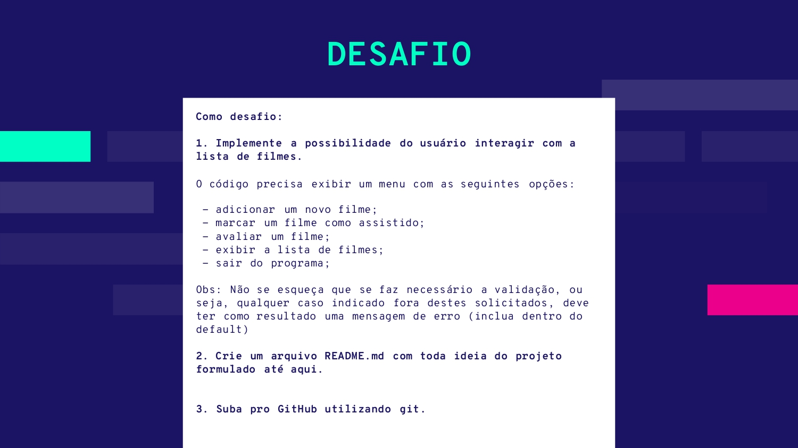

# Desafio 2 - Gerenciador de Filmes

Este é o Desafio 2 da aula de laboratório da disciplina de Engenharia de Software.

## Funcionalidades

- Adicionar novo filme à lista.
- Marcar filme como assistido.
- Avaliar filme.
- Exibir lista de filmes.
- Sair do programa.

## Enunciado do desafio: 
