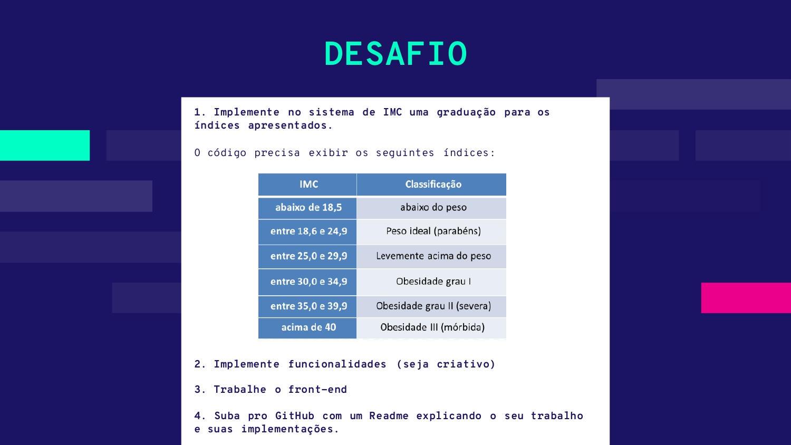

# Calculadora de IMC com Svelte

Este é um aplicativo simples de calculadora de Índice de Massa Corporal (IMC) construído com Svelte. O IMC é uma medida que relaciona o peso e a altura de uma pessoa, fornecendo uma indicação geral de sua saúde em relação ao peso.

## Funcionalidades

- Calcula o IMC com base no peso e altura fornecidos pelo usuário.
- Classifica o IMC em diferentes categorias: abaixo do peso, peso ideal, levemente acima do peso, obesidade grau I, obesidade grau II (severa) e obesidade grau III (mórbida).
- Interface de usuário agradável.
- Utiliza um fundo gradiente colorido para melhor visualização.

## Pré-requisitos

- Necessária instalação do node.

## Como usar

1. Clone ou faça o download deste repositório para o seu computador.
2. Navegue até o diretório onde você salvou os arquivos.
3. Abra o arquivo `App.svelte` em um navegador da web.

## Uso do Svelte

Este projeto utiliza o framework Svelte, uma tecnologia de compilação que permite criar interfaces de usuário reativas de forma eficiente. O Svelte foi apresentado na aula 03 de Engenharia de Software e é uma opção poderosa para construir aplicações web modernas de forma simples.

## Contribuição

Contribuições são bem-vindas! Se você encontrar problemas ou tiver sugestões de melhorias, sinta-se à vontade para abrir uma Issue ou enviar um Pull Request.

## Enunciado do desafio: 

