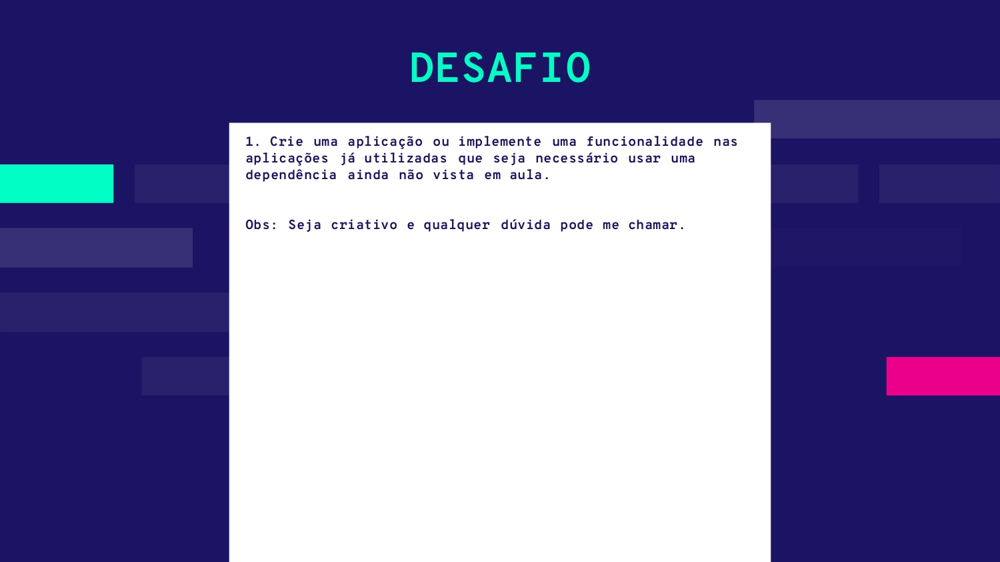

# Aplicação Marcar Gol

Esta é uma simples aplicação web que permite ao usuário marcar um gol a cada vez que o botão "Marcar Gol" é pressionado. A aplicação também exibirá uma mensagem na tela informando que um gol foi marcado.

## Funcionalidades

- Botão "Marcar Gol" para registrar gols.
- Exibição de mensagens informando a contagem de gols marcados.
- Estilização CSS para uma melhor visualização.
- Utilização da dependência `sweetalert2` para exibir mensagens.

## Dependências

Esta aplicação utiliza a biblioteca `sweetalert2` para exibir mensagens na tela. Para instalar a dependência, você pode executar o seguinte comando:

```
npm install sweetalert2@^11.7.27
```

## Enunciado do desafio

